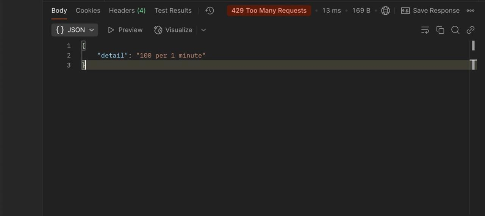

# **API Data Extractor**

## **Overview**
This project is an automated API data extractor that:
- Determines API rate limits dynamically

---

## **Features**
✅ **Automated Rate Limit Detection** – Determines API request limits dynamically  
✅ **Logging & Error Handling** – Saves logs for debugging and tracking    

---

## **Installation**

1. **Clone the repository**  
   ```bash
   git clone <repo-url>
   cd <repo-folder>
   ```  

2. **Install dependencies**  
   ```bash
   npm install
   ```  

3. **Set up environment variables**  
   Create a `.env` file in the project root and add:  
   ```env
   BASE_URL=<your-api-base-url>
   ```  

---

## **Usage**

### **Extract Data from API**
Run the main extraction script:
```bash
node index.js
```

### **Log Output**
Logs are stored in the `logs/` directory:
```plaintext
logs/logs_global.txt
logs/logs_v1.txt
logs/logs_v2.txt
logs/logs_v3.txt
```

---

## **How It Works**

### **1. Find API Rate Limits**
- `limit.js` determines the maximum requests per minute using **binary search**.

## **Error Handling & Logging**

- **Handles API rate limits dynamically** (`429 Too Many Requests`)  
- **Retries failed requests** and **logs errors**  
- **Pauses execution** when rate limits are exceeded  

---

## **Observations**
This project is open-source. Feel free to modify and enhance it!  

1. There are 3 API versions available
   1. /v1/autocomplete?query=<some_string>
   2. /v2/autocomplete?query=<some_string>
   3. /v3/autocomplete?query=<some_string>
2. The rate limit corresponding to each version is asfollows
   1. v1 : `100 req/min`
   2. v2 : `50 req/min`
   3. v3 : `80 req/min`
3. One thing to note is that the rate limit can be found in two ways, 
   1. We send too many request at once and server responds with 429 status, and in your case it directly present in `details` 
   2. Or if in any case server doesn't respond directly with rate limit then we can use the algorithm that I had written using binary search, the logic is simple.. send `X` number of requests if ay one failed then it can't be the rate limit, so go `low`, otherwise go `high`